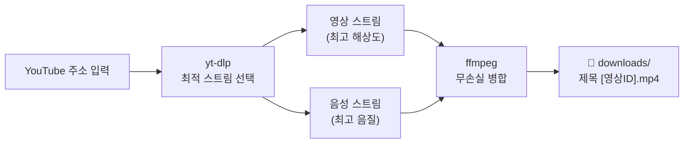
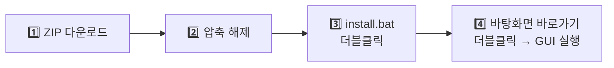

# YouTube 고화질 다운로더

[](https://github.com/KIMHeeKwon/Youtube_Downlaod/actions)
[](LICENSE)
[](pyproject.toml)

YouTube 영상을 **가용 최고 화질**로 내려받아 단일 MP4 파일로 저장하는 도구입니다.
데스크톱 GUI · 웹 화면 · 명령줄(CLI) 세 가지 방식을 모두 지원합니다.

> ⚠️ **사용 범위**: 본인이 올린 영상, Creative Commons 라이선스 영상,
> 개인적·연구 목적 이용에 한정해 사용하세요. 자세한 내용은 [면책 조항](#-라이선스--면책-조항) 참조.

---

## 주요 기능

| 기능 | 설명 |
|------|------|
| 🎬 최고 화질 다운로드 | 4K/8K 포함, 영상+음성 분리 스트림을 무손실 병합해 단일 MP4 생성 |
| 📋 재생목록 일괄 다운로드 | `playlist?list=...` 주소를 넣으면 전체 영상을 폴더로 정리해 저장 |
| 💬 자막 동시 저장 | 원하는 언어의 자막을 `.srt` 파일로 함께 저장 (자동 생성 자막 포함) |
| 🖥️ 3가지 사용 방식 | Windows GUI 앱 / 브라우저 웹 화면 / 터미널 CLI |
| 📉 해상도·코덱 제어 | 해상도 상한(예: 1080p), 구형 기기 호환 모드(H.264+AAC) 선택 가능 |

지원 주소 형식: 일반 영상(`watch?v=`) · 단축(`youtu.be/`) · Shorts · 라이브 다시보기(`/live/`) · 재생목록(`playlist?list=`)

## 동작 원리



YouTube는 1080p 초과 화질을 영상/음성 분리 스트림으로만 제공하므로,
최고 화질 확보의 핵심은 **최적 스트림 선택 + 무손실 병합**입니다. 이 도구가 자동으로 처리합니다.

---

## 🪟 설치 — Windows (원클릭, 일반 사용자용)

터미널 지식이 전혀 필요 없습니다. 관리자 권한도 필요 없습니다.



### 1단계 — 내려받기
저장소 페이지 우측 상단 **`< > Code` 초록 버튼 → `Download ZIP`** 클릭.

### 2단계 — 압축 해제
받은 ZIP을 원하는 위치에 풀기 (예: `C:\Apps\Youtube_Downlaod`).
경로에 특별한 제약은 없습니다.

### 3단계 — 설치 실행
푼 폴더 안에서 **`windows` 폴더 → `install.bat` 더블클릭**.

- "Windows에서 PC를 보호했습니다" 파란 창이 뜨면: **[추가 정보] → [실행]**
  (서명되지 않은 스크립트라 표시되는 정상적인 경고입니다)
- 검은 창에서 자동으로 진행됩니다 (약 3~5분):

| 순서 | 설치 항목 | 역할 | 설치 위치 |
|------|-----------|------|-----------|
| 1 | uv + Python 3.12 | 실행 환경 (시스템 Python 불필요) | 사용자 폴더 |
| 2 | deno | 전체 화질 추출용 JS 런타임 | 사용자 폴더 |
| 3 | ffmpeg | 영상+음성 병합기 (공식 빌드 자동 다운로드) | 프로젝트 `tools\` |
| 4 | 라이브러리 | yt-dlp 등 (프로젝트 폴더 안에 격리) | 프로젝트 `.venv\` |
| 5 | 바로가기 | 바탕화면 **"YouTube Downloader"** 생성 | 바탕화면 |

시스템 전역이나 레지스트리는 건드리지 않습니다. 삭제하려면 폴더와 바로가기만 지우면 됩니다.

### 4단계 — 실행
바탕화면의 **YouTube Downloader**를 더블클릭하면 콘솔 창 없이 GUI가 바로 열립니다.

## 🍎 설치 — macOS

```bash
# 1. 필수 도구 (Homebrew 필요 — https://brew.sh)
brew install ffmpeg uv deno

# 2. 프로젝트 받기 및 구성
git clone https://github.com/KIMHeeKwon/Youtube_Downlaod.git
cd Youtube_Downlaod
uv sync
```

`uv sync` 한 번이면 Python 3.12와 모든 라이브러리가 프로젝트 폴더 안에 격리 설치됩니다.

---

## 사용 방법

### 방법 1 — 데스크톱 GUI (Windows 권장)

바탕화면 바로가기 더블클릭 → 아래 화면이 열립니다.

```
┌─────────────────────────────────────────────────────────┐
│  YouTube 고화질 다운로더                            _ □ ✕ │
├─────────────────────────────────────────────────────────┤
│  YouTube 주소                                            │
│  ┌─────────────────────────────────────────────────────┐│
│  │ https://www.youtube.com/watch?v=...                 ││
│  └─────────────────────────────────────────────────────┘│
│  최대 해상도    코덱       자막 언어 (예: ko,en)          │
│  [무제한 ▼]   [best ▼]   [________]      [ 다운로드 ]   │
│                                                          │
│  ████████████████████░░░░░░░░░░  67.3%                   │
│  다운로드 중 67.3% 8.4 MB/s            [저장 폴더 열기]  │
│  ┌─────────────────────────────────────────────────────┐│
│  │ 완료: 영상제목 [dQw4w9WgXcQ].mp4                    ││
│  │ (작업 기록이 여기에 누적 표시됩니다)                 ││
│  └─────────────────────────────────────────────────────┘│
└─────────────────────────────────────────────────────────┘
```

| 항목 | 사용법 |
|------|--------|
| YouTube 주소 | 영상 또는 재생목록 주소 붙여넣기 (`Ctrl+V`) |
| 최대 해상도 | `무제한`(기본, 최고 화질) / 2160 / 1080 / 720 중 선택 |
| 코덱 | `best`(기본, 최고 화질) / `compat`(구형 기기·플레이어 호환 H.264+AAC) |
| 자막 언어 | 비우면 자막 없음. `ko,en`처럼 쉼표로 여러 언어 지정 → `.srt` 파일 동시 저장 |
| 다운로드 | 클릭 후 진행률 바로 상황 확인. 재생목록은 `[3/10]`처럼 몇 번째인지 표시 |
| 저장 폴더 열기 | 완료된 파일이 있는 `downloads` 폴더를 탐색기로 즉시 열기 |

### 방법 2 — 웹 화면 (브라우저)

```bash
# macOS / 터미널
uv run uvicorn webapp:app
# Windows: windows\start.bat 더블클릭 (브라우저 자동 오픈)
```

브라우저에서 **http://127.0.0.1:8000** 접속 → 주소 입력 → [시작].
여러 건을 연달아 등록할 수 있고 작업 목록에서 각각의 진행률이 1초마다 갱신됩니다.
내 컴퓨터에서만 접속 가능하며 외부에 노출되지 않습니다.

### 방법 3 — 명령줄 (CLI)

```bash
uv run python main.py [옵션] "<YouTube 주소>"
```

| 옵션 | 기본값 | 설명 |
|------|--------|------|
| `-o, --output-dir` | `./downloads` | 저장 폴더 |
| `--max-height N` | 무제한 | 해상도 상한 (예: `1080`) |
| `--codec {best,compat}` | `best` | `best`=최고 화질(VP9/AV1 허용), `compat`=H.264+AAC 호환 우선 |
| `--subs LANGS` | 없음 | 자막 언어, 쉼표 구분 (예: `ko,en`) |

**예제 모음**:

```bash
# 최고 화질로 다운로드
uv run python main.py "https://www.youtube.com/watch?v=dQw4w9WgXcQ"

# 1080p 이하 + 구형 플레이어 호환 코덱
uv run python main.py --max-height 1080 --codec compat "https://youtu.be/dQw4w9WgXcQ"

# 한국어·영어 자막(.srt) 동시 저장
uv run python main.py --subs ko,en "https://www.youtube.com/watch?v=dQw4w9WgXcQ"

# 재생목록 전체를 일괄 다운로드 (재생목록 이름의 하위 폴더에 정리됨)
uv run python main.py "https://www.youtube.com/playlist?list=PLxxxxxxxxxxxx"

# 라이브 방송 다시보기 다운로드
uv run python main.py "https://youtube.com/live/xxxxxxxxxxx"

# 저장 위치 지정
uv run python main.py -o ~/Movies "https://youtu.be/dQw4w9WgXcQ"
```

### 결과물 위치와 파일명 규칙

```
downloads/
├── 영상제목 [영상ID].mp4              ← 단일 영상
├── 영상제목 [영상ID].ko.srt           ← 자막 (--subs 사용 시)
└── 재생목록이름/                      ← 재생목록
    ├── 첫번째영상 [ID].mp4
    └── 두번째영상 [ID].mp4
```

---

## 문제 해결

| 증상 | 원인 / 해결 |
|------|-------------|
| "ffmpeg가 필요합니다" | macOS: `brew install ffmpeg` / Windows: `install.bat` 재실행 |
| 소리가 안 남 (구형 QuickTime 등) | 기본 모드는 최신 opus 음성 코덱 사용 → `compat` 코덱으로 다시 받거나 [VLC](https://www.videolan.org/)로 재생 |
| 특정 영상 실패 | 비공개·삭제·연령제한·지역제한 영상 — 오류 메시지에 원인이 표시됨 |
| 어느 날부터 다운로드 실패 | YouTube 내부 변경 — `uv sync --upgrade`로 yt-dlp 업데이트 후 재시도 |
| Windows 보안 경고 | 서명되지 않은 스크립트 경고 — [추가 정보] → [실행] |
| 8000 포트 충돌 (웹 UI) | `--port 8080` 등 다른 포트로 실행 |

## 문서

| 문서 | 내용 |
|------|------|
| [docs/DESIGN.md](docs/DESIGN.md) | 시스템 설계서 (기술 선정 근거, 아키텍처, 라이선스 분석) |
| [docs/IMPLEMENTATION.md](docs/IMPLEMENTATION.md) | MVP 구현 명세서 |
| [docs/PHASE2.md](docs/PHASE2.md) | 재생목록·자막·웹 UI 확장 명세서 |
| [docs/WINDOWS.md](docs/WINDOWS.md) | Windows 원클릭 설치 상세 가이드 |

---

## 📜 라이선스 & 면책 조항

### 코드 라이선스

본 프로젝트 코드는 [MIT License](LICENSE)로 배포됩니다.
소프트웨어는 **"있는 그대로(AS IS)" 제공되며, 사용으로 인해 발생하는 어떠한 문제에 대해서도
저작자는 책임을 지지 않습니다.**

### 사용 조건 및 면책

1. **개인적 이용**: 본 도구는 개인적·연구 목적으로 제공됩니다. 이 경우에도 아래
   서드파티 구성요소 각각의 라이선스 조건을 준수하는 범위에서 사용해야 합니다.
2. **콘텐츠 저작권**: 다운로드하는 콘텐츠에 대한 권리 확인은 전적으로 사용자의 책임입니다.
   본인 업로드 콘텐츠, Creative Commons 라이선스 영상, 사적 이용 범위의 복제
   (대한민국 저작권법 제30조)에 한정해 사용하세요. 타인 저작물의 무단 복제·재배포는
   저작권 침해이며, YouTube 서비스 약관은 공식 기능 외의 다운로드를 제한합니다.
3. **상업적 이용·수정·재배포**: MIT 라이선스에 따라 가능하나, 그로 인해 발생하는
   법적 문제·손해·분쟁에 대해 **원저작자는 어떠한 책임도 지지 않습니다.**
   상업적 이용 시 서드파티 라이선스(특히 ffmpeg GPL) 검토는 이용자의 몫입니다.
4. **DRM**: 본 도구는 DRM 우회 기능을 포함하지 않으며, 유료·멤버십 콘텐츠 다운로드를
   지원하지 않습니다.

### 서드파티 구성요소

| 구성요소 | 라이선스 | 배포 방식 |
|----------|----------|-----------|
| [yt-dlp](https://github.com/yt-dlp/yt-dlp) | Unlicense (퍼블릭 도메인) | pip 의존성 |
| [ffmpeg](https://ffmpeg.org/) | GPL v2+ | **본 저장소에 미포함** — 사용자가 시스템에 직접 설치(macOS)하거나 설치 스크립트가 사용자 PC에서 공식 빌드([gyan.dev](https://www.gyan.dev/ffmpeg/builds/))를 직접 내려받음 |
| [FastAPI](https://fastapi.tiangolo.com/) | MIT | pip 의존성 |
| [uvicorn](https://www.uvicorn.org/) | BSD-3-Clause | pip 의존성 |
| Python / tkinter | PSF License | uv가 설치 |
| [deno](https://deno.land/) | MIT | 사용자 시스템 설치 |

ffmpeg 바이너리를 본 저장소가 재배포하지 않으므로 본 코드에는 GPL 의무가 전파되지 않습니다.
**ffmpeg를 동봉해 재배포하는 경우 GPL 의무(소스 고지 등)는 재배포자에게 발생합니다.**
